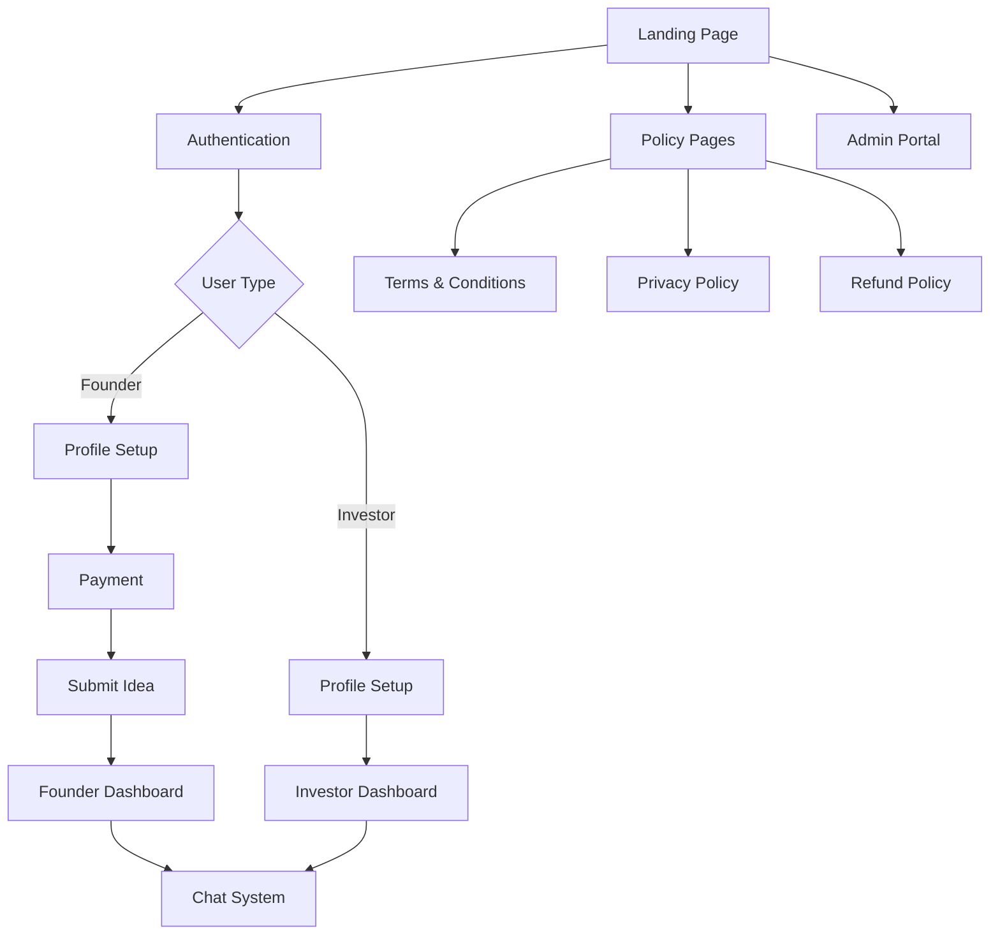

# 🚀 INNOVESTOR - Project Overview

> **Connecting Innovators with Investors**  
> A premium fintech platform that bridges the gap between visionary founders and strategic investors.

---

## 🎯 Mission Statement

INNOVESTOR is designed to democratize the fundraising process, making it easier for founders to pitch their ideas and for investors to discover promising ventures.

---

## 📌 Quick Links

### Core Documentation
- [[01 - Architecture Overview|Architecture Overview]] - System design and tech stack
- [[02 - Database Schema|Database Schema]] - Supabase tables and relationships
- [[03 - User Flows|User Flows]] - User journeys and interactions
- [[04 - Features|Features]] - Complete feature breakdown

### User Roles
- [[Founders/00 - Founder Hub|Founder Hub]] - Everything for founders
- [[Investors/00 - Investor Hub|Investor Hub]] - Everything for investors
- [[Admin/00 - Admin Hub|Admin Hub]] - Administration portal

### Development
- [[Development/00 - Dev Setup|Development Setup]] - Getting started guide
- [[Development/01 - Component Library|Component Library]] - UI components
- [[Development/02 - API Reference|API Reference]] - Backend integrations

### Policies & Legal
- [[Legal/Terms and Conditions|Terms and Conditions]]
- [[Legal/Privacy Policy|Privacy Policy]]
- [[Legal/Refund Policy|Refund Policy]]

---

## 🛠️ Tech Stack

| Layer | Technology |
|-------|------------|
| Frontend | React 18 + TypeScript |
| Build Tool | Vite |
| Styling | Tailwind CSS |
| UI Components | shadcn/ui |
| Animations | Framer Motion |
| Backend | Supabase (PostgreSQL) |
| Authentication | Supabase Auth |
| Payments | Razorpay |
| Hosting | Vercel |

---

## 📊 Project Statistics

- **Pages**: 14 main pages
- **Components**: 52+ UI components
- **Database Tables**: 7 core tables
- **Migrations**: 12 applied migrations

---

## 🗺️ Site Map



---

## 📅 Development Phases

### ✅ Phase 1: Foundation (Completed)
- [x] Project setup with Vite + React + TypeScript
- [x] Supabase integration
- [x] Authentication system
- [x] Basic routing

### ✅ Phase 2: Core Features (Completed)
- [x] User profiles (Founder & Investor)
- [x] Idea submission system
- [x] Chat request system
- [x] Real-time messaging

### ✅ Phase 3: Monetization (Completed)
- [x] Razorpay payment integration
- [x] Coupon system
- [x] Investment recording

### ✅ Phase 4: Premium UI (Completed)
- [x] Fintech-style animations
- [x] Glassmorphism effects
- [x] Interactive particle backgrounds
- [x] Responsive design

### 🔄 Phase 5: Enhancement (In Progress)
- [ ] Investor ratings system
- [ ] Advanced analytics
- [ ] Notification system
- [ ] Mobile app consideration

---

## 📁 Project Structure

```
happy-helper/
├── src/
│   ├── components/     # UI Components (52+)
│   │   ├── ui/         # shadcn/ui components
│   │   └── cursor/     # Custom cursor effects
│   ├── pages/          # 14 Route pages
│   ├── hooks/          # Custom React hooks
│   ├── integrations/   # Supabase client & types
│   └── lib/            # Utility functions
├── supabase/
│   └── migrations/     # 12 SQL migrations
├── backend/            # Node.js API routes
└── public/             # Static assets
```

---

## 🔗 Related Documents

- [[Changelog]] - Version history
- [[Roadmap]] - Future plans
- [[Ideas Backlog]] - Feature ideas
- [[Meeting Notes]] - Team discussions

---

*Last Updated: January 31, 2026*
