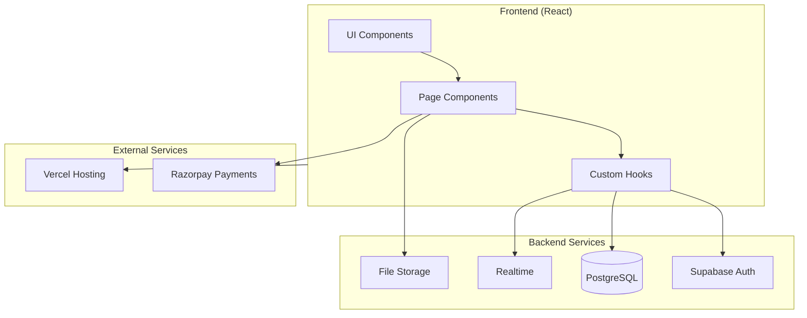
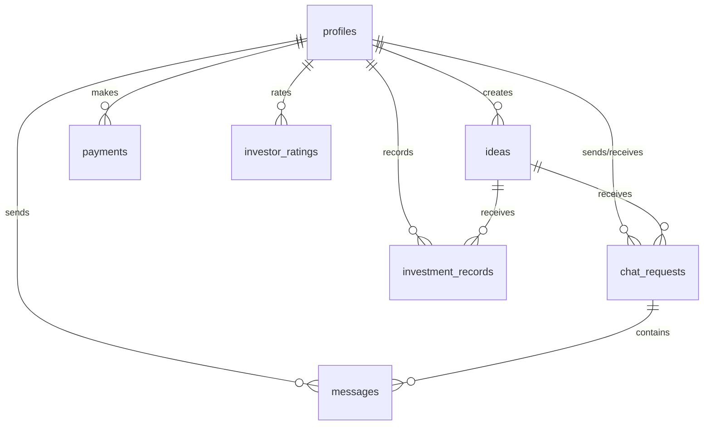
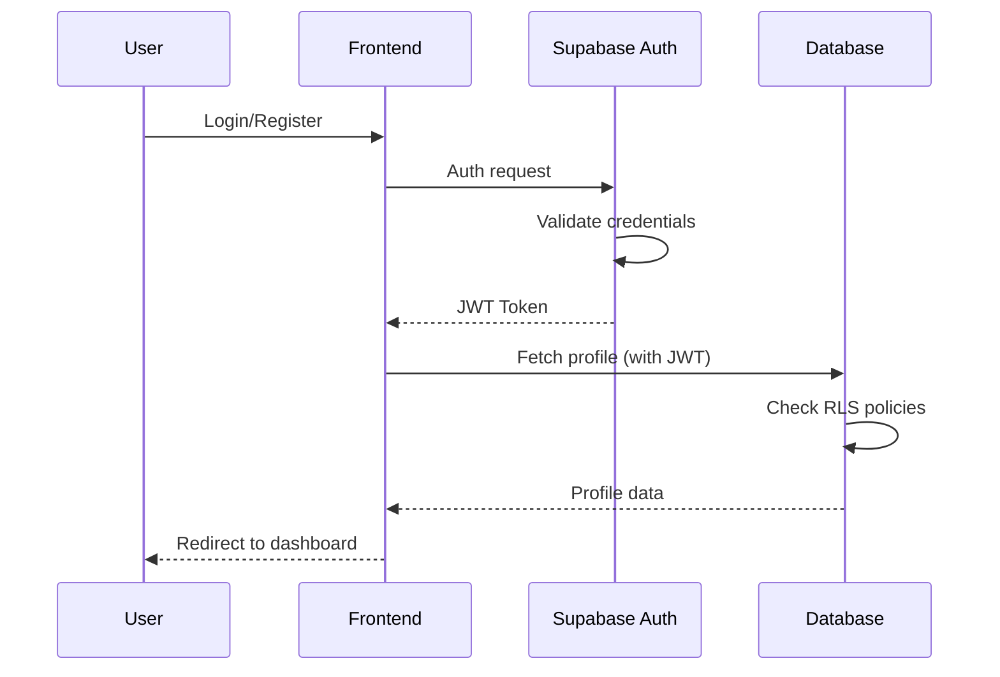
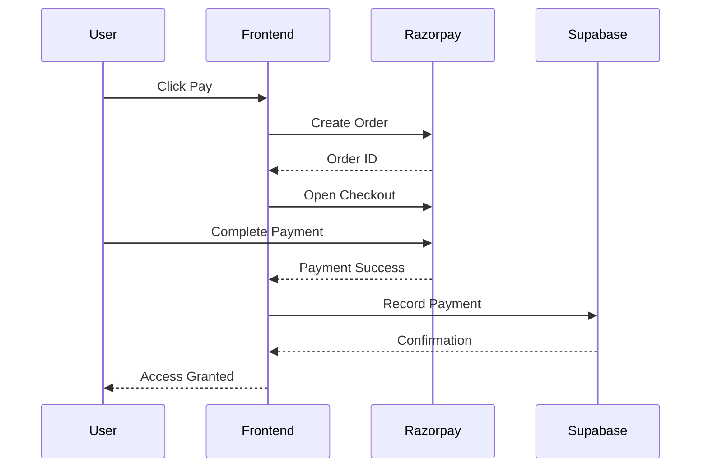
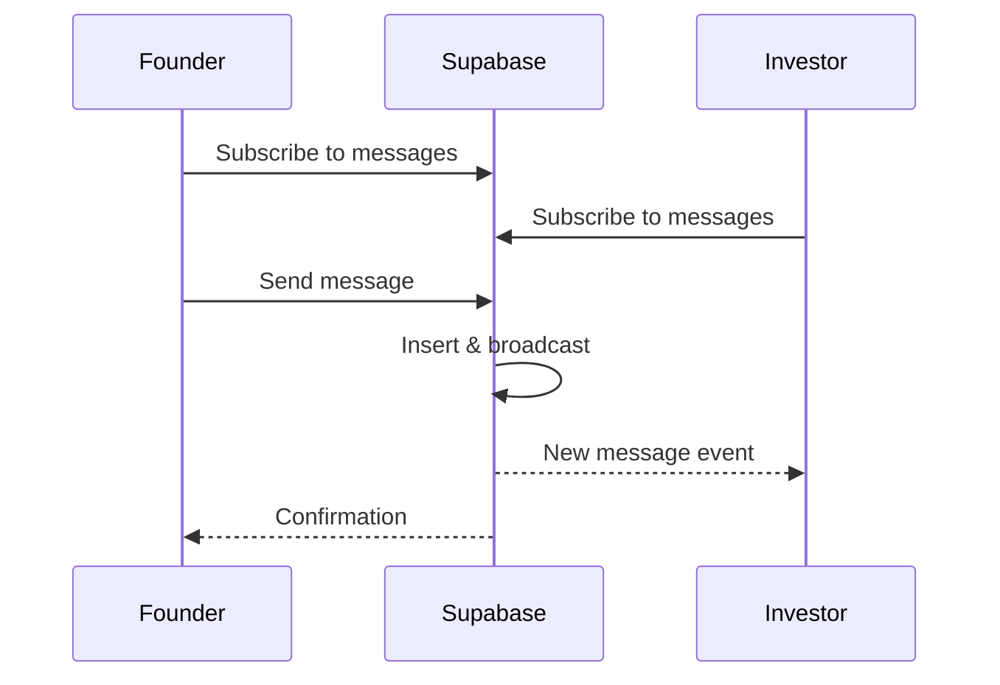

# 🏗️ Architecture Overview

> System design and technical architecture of INNOVESTOR

---

## 📐 High-Level Architecture



---

## 🧱 Frontend Architecture

### Technology Stack
| Technology | Version | Purpose |
|------------|---------|---------|
| React | 18.x | UI Framework |
| TypeScript | 5.x | Type Safety |
| Vite | 5.x | Build Tool |
| Tailwind CSS | 3.x | Styling |
| shadcn/ui | Latest | Component Library |
| Framer Motion | 11.x | Animations |
| React Router | 6.x | Routing |
| TanStack Query | 5.x | Server State |
| Zod | 3.x | Validation |
| Recharts | 2.x | Charts |

### Folder Structure

```
src/
├── components/
│   ├── ui/                    # shadcn/ui base components
│   │   ├── button.tsx
│   │   ├── card.tsx
│   │   ├── dialog.tsx
│   │   ├── input.tsx
│   │   └── ... (49 components)
│   ├── cursor/                # Custom cursor effects
│   ├── AnimatedGridBackground.tsx
│   ├── ChatBox.tsx
│   └── NavLink.tsx
│
├── pages/
│   ├── Landing.tsx            # Home page
│   ├── Auth.tsx               # Login/Register
│   ├── ProfileSetup.tsx       # Onboarding
│   ├── FounderDashboard.tsx   # Founder panel
│   ├── InvestorDashboard.tsx  # Investor panel
│   ├── Payment.tsx            # Razorpay integration
│   ├── SubmitIdea.tsx         # Idea submission
│   ├── AdminPortal.tsx        # Admin panel
│   ├── Profile.tsx            # User profile
│   ├── PrivacyPolicy.tsx
│   ├── TermsAndConditions.tsx
│   ├── RefundPolicy.tsx
│   └── NotFound.tsx           # 404 page
│
├── hooks/
│   └── use-toast.ts           # Toast notifications
│
├── integrations/
│   └── supabase/
│       ├── client.ts          # Supabase client init
│       └── types.ts           # Generated DB types
│
├── lib/
│   └── utils.ts               # Utility functions
│
├── App.tsx                    # Main app with routes
├── main.tsx                   # Entry point
├── index.css                  # Global styles
└── App.css                    # App-specific styles
```

---

## 🗄️ Backend Architecture

### Supabase Services Used

| Service | Usage |
|---------|-------|
| **Authentication** | Email/password auth, session management |
| **Database** | PostgreSQL with Row Level Security |
| **Realtime** | Live chat updates via subscriptions |
| **Storage** | User avatars, idea media |

### Database Schema Overview

See [[02 - Database Schema]] for detailed table structures.



---

## 🔐 Security Architecture

### Row Level Security (RLS)

All tables have RLS enabled with policies:

| Table | Policy |
|-------|--------|
| `profiles` | Users can only CRUD their own profile |
| `ideas` | Founders manage own; investors view all |
| `chat_requests` | Participants only |
| `messages` | Chat participants with accepted status |
| `payments` | User's own payments only |

### Authentication Flow



---

## 💳 Payment Architecture

### Razorpay Integration Flow



### Coupon System
Valid coupons: `FREEIDEA`, `INNOVESTOR100`, `SKIP2026`

---

## 🔄 Realtime Architecture

### Chat System



Tables with realtime enabled:
- `messages` - Chat messages

---

## 🎨 UI/UX Architecture

### Design System

- **Colors**: Dark mode primary with accent gradients
- **Typography**: System fonts with custom weights
- **Spacing**: 4px base unit
- **Animations**: Framer Motion variants

### Animation Variants
```typescript
containerVariants = {
  hidden: { opacity: 0 },
  visible: {
    opacity: 1,
    transition: { staggerChildren: 0.08 }
  }
}
```

---

## 🔗 Related Documents

- [[00 - Overview|Overview]]
- [[02 - Database Schema|Database Schema]]
- [[Development/01 - Component Library|Component Library]]
- [[Development/02 - API Reference|API Reference]]

---

*Last Updated: January 31, 2026*
