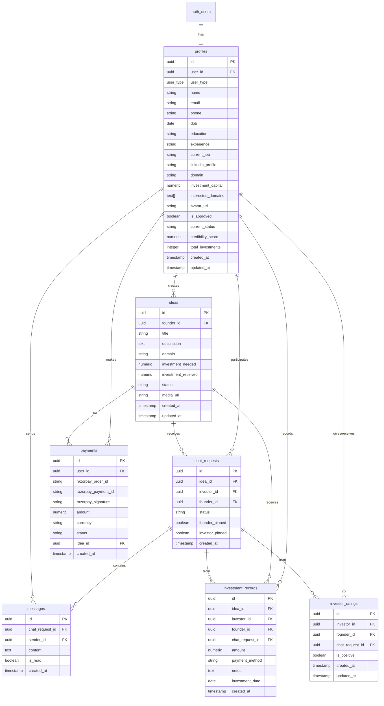

# 🗄️ Database Schema

> Complete database structure for INNOVESTOR

---

## 📊 Entity Relationship Diagram

---

## 📋 Table Details

### profiles
User profile information for both founders and investors.

| Column | Type | Constraints | Description |
|--------|------|-------------|-------------|
| `id` | UUID | PK, DEFAULT gen_random_uuid() | Primary key |
| `user_id` | UUID | FK → auth.users, UNIQUE, NOT NULL | Auth user reference |
| `user_type` | ENUM | NOT NULL | 'founder' or 'investor' |
| `name` | TEXT | NOT NULL | Display name |
| `email` | TEXT | NOT NULL | Email address |
| `phone` | TEXT | | Phone number |
| `dob` | DATE | | Date of birth |
| `education` | TEXT | | Educational background |
| `experience` | TEXT | | Work experience |
| `current_job` | TEXT | | Current position |
| `linkedin_profile` | TEXT | | LinkedIn URL |
| `domain` | TEXT | | Primary domain (founders) |
| `investment_capital` | NUMERIC | | Available capital (investors) |
| `interested_domains` | TEXT[] | | Array of interested domains |
| `avatar_url` | TEXT | | Profile picture URL |
| `is_approved` | BOOLEAN | | Admin approval status |
| `current_status` | TEXT | | User status message |
| `credibility_score` | NUMERIC | | Calculated credibility |
| `total_investments` | INTEGER | | Count of investments made |
| `created_at` | TIMESTAMPTZ | DEFAULT now() | Creation timestamp |
| `updated_at` | TIMESTAMPTZ | DEFAULT now() | Last update timestamp |

**RLS Policies:**
- Users can view/insert/update their own profile
- Authenticated users can view basic profile info (for chat)

---

### ideas
Startup ideas submitted by founders.

| Column | Type | Constraints | Description |
|--------|------|-------------|-------------|
| `id` | UUID | PK | Primary key |
| `founder_id` | UUID | FK → profiles, NOT NULL | Creator reference |
| `title` | TEXT | NOT NULL | Idea title |
| `description` | TEXT | NOT NULL | Full description |
| `domain` | TEXT | NOT NULL | Industry/domain |
| `investment_needed` | NUMERIC | NOT NULL | Target funding |
| `investment_received` | NUMERIC | DEFAULT 0 | Current funding |
| `status` | TEXT | CHECK constraint | pending/in_progress/funded/completed |
| `media_url` | TEXT | | Google Drive link for pitch deck |
| `created_at` | TIMESTAMPTZ | DEFAULT now() | Creation timestamp |
| `updated_at` | TIMESTAMPTZ | DEFAULT now() | Last update timestamp |

**Status Values:** `pending`, `in_progress`, `funded`, `completed`

**RLS Policies:**
- Founders can manage their own ideas
- Investors can view all ideas

---

### chat_requests
Connection requests from investors to founders.

| Column | Type | Constraints | Description |
|--------|------|-------------|-------------|
| `id` | UUID | PK | Primary key |
| `idea_id` | UUID | FK → ideas, NOT NULL | Related idea |
| `investor_id` | UUID | FK → profiles, NOT NULL | Investor requesting |
| `founder_id` | UUID | FK → profiles, NOT NULL | Founder receiving |
| `status` | TEXT | CHECK constraint | pending/accepted/rejected |
| `founder_pinned` | BOOLEAN | | Pinned by founder |
| `investor_pinned` | BOOLEAN | | Pinned by investor |
| `created_at` | TIMESTAMPTZ | DEFAULT now() | Creation timestamp |

**Status Values:** `pending`, `accepted`, `rejected`

**RLS Policies:**
- Users can view their own chat requests
- Investors can create chat requests
- Founders can update request status

---

### messages
Real-time chat messages between users.

| Column | Type | Constraints | Description |
|--------|------|-------------|-------------|
| `id` | UUID | PK | Primary key |
| `chat_request_id` | UUID | FK → chat_requests, NOT NULL | Parent chat |
| `sender_id` | UUID | FK → profiles, NOT NULL | Message sender |
| `content` | TEXT | NOT NULL | Message text |
| `is_read` | BOOLEAN | | Read status |
| `created_at` | TIMESTAMPTZ | DEFAULT now() | Creation timestamp |

**Realtime:** Enabled for live updates

**RLS Policies:**
- Chat participants can view messages
- Participants can send messages (only in accepted chats)

---

### payments
Razorpay payment records.

| Column | Type | Constraints | Description |
|--------|------|-------------|-------------|
| `id` | UUID | PK | Primary key |
| `user_id` | UUID | FK → profiles, NOT NULL | Paying user |
| `razorpay_order_id` | TEXT | | Payment order ID |
| `razorpay_payment_id` | TEXT | | Actual payment ID |
| `razorpay_signature` | TEXT | | Verification signature |
| `amount` | NUMERIC | NOT NULL | Payment amount |
| `currency` | TEXT | NOT NULL | Currency code (INR) |
| `status` | TEXT | NOT NULL | created/paid/failed |
| `idea_id` | UUID | FK → ideas | Related idea |
| `created_at` | TIMESTAMPTZ | DEFAULT now() | Creation timestamp |

**RLS Policies:**
- Users can only view/create their own payments

---

### investment_records
Track investments made by investors to ideas.

| Column | Type | Constraints | Description |
|--------|------|-------------|-------------|
| `id` | UUID | PK | Primary key |
| `idea_id` | UUID | FK → ideas, NOT NULL | Invested idea |
| `investor_id` | UUID | FK → profiles, NOT NULL | Investing user |
| `founder_id` | UUID | FK → profiles, NOT NULL | Receiving founder |
| `chat_request_id` | UUID | FK → chat_requests | Connection reference |
| `amount` | NUMERIC | NOT NULL | Investment amount |
| `payment_method` | TEXT | | Method of payment |
| `notes` | TEXT | | Additional notes |
| `investment_date` | DATE | | Date of investment |
| `created_at` | TIMESTAMPTZ | DEFAULT now() | Creation timestamp |

**Trigger:** Updates `investment_received` on ideas automatically

---

### investor_ratings
Founder ratings for investors (thumbs up/down).

| Column | Type | Constraints | Description |
|--------|------|-------------|-------------|
| `id` | UUID | PK | Primary key |
| `investor_id` | UUID | FK → profiles, NOT NULL | Rated investor |
| `founder_id` | UUID | FK → profiles, NOT NULL | Rating founder |
| `chat_request_id` | UUID | FK → chat_requests | Chat context |
| `is_positive` | BOOLEAN | NOT NULL | true=👍, false=👎 |
| `created_at` | TIMESTAMPTZ | DEFAULT now() | Creation timestamp |
| `updated_at` | TIMESTAMPTZ | DEFAULT now() | Last update |

**Unique Constraint:** One rating per founder-investor-chat combination

---

## 🔧 Database Functions

### mark_messages_as_read(chat_id UUID)
Marks all messages in a chat as read for the current user.

### update_updated_at_column()
Trigger function to automatically update `updated_at` timestamps.

---

## 📈 Migrations History

| Date | Migration | Description |
|------|-----------|-------------|
| 2026-01-10 | Initial schema | Core tables (profiles, ideas, chat_requests, messages) |
| 2026-01-10 | User type fixes | Additional schema corrections |
| 2026-01-21 | is_read column | Add read status to messages |
| 2026-01-21 | Message updates | Allow message updates |
| 2026-01-21 | Mark read function | Add function for marking messages read |
| 2026-01-25 | Payments table | Razorpay integration support |
| 2026-01-25 | Current status | Profile status field |
| 2026-01-25 | Credibility fields | Credibility score and total investments |
| 2026-01-27 | Pinned status | Chat pinning feature |
| 2026-01-27 | Investment records | Track investments |
| 2026-01-28 | Fix RLS | Profile RLS corrections |
| 2026-01-30 | Investor ratings | Rating system for investors |

---

## 🔗 Related Documents

- [[00 - Overview|Overview]]
- [[01 - Architecture Overview|Architecture Overview]]
- [[Development/02 - API Reference|API Reference]]

---

*Last Updated: January 31, 2026*
