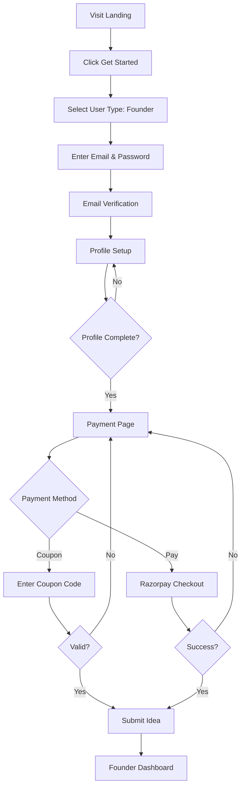
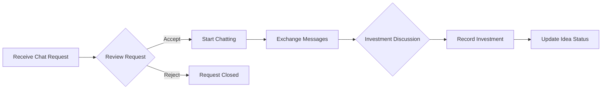
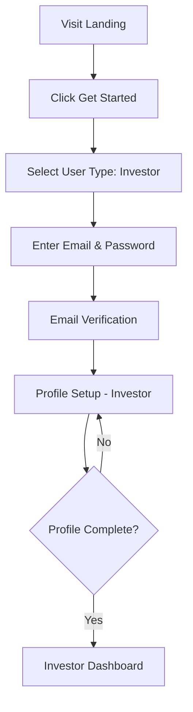
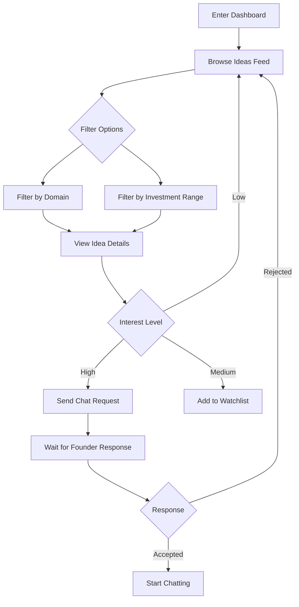
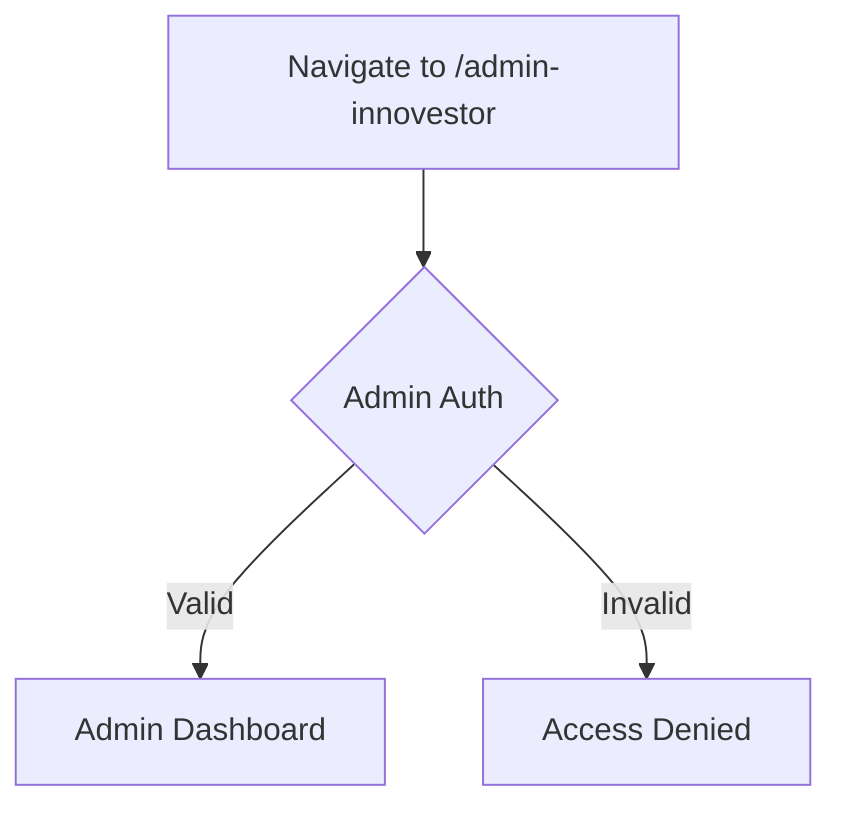
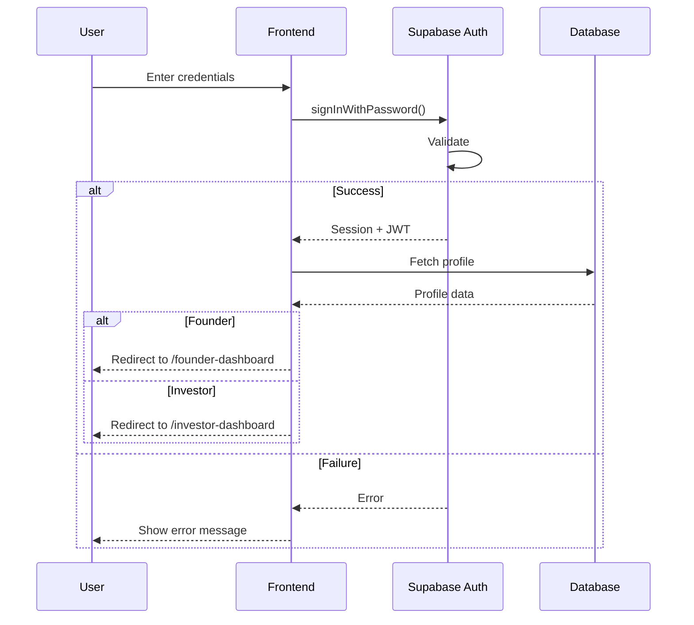
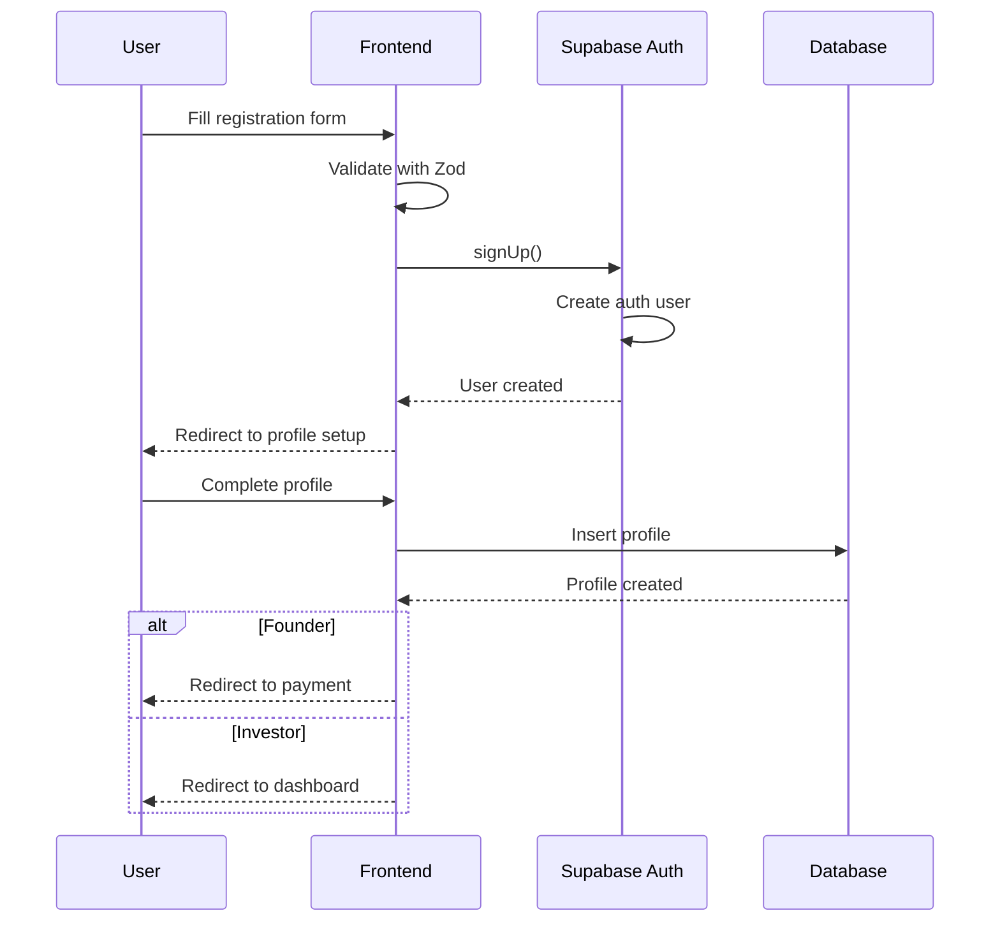
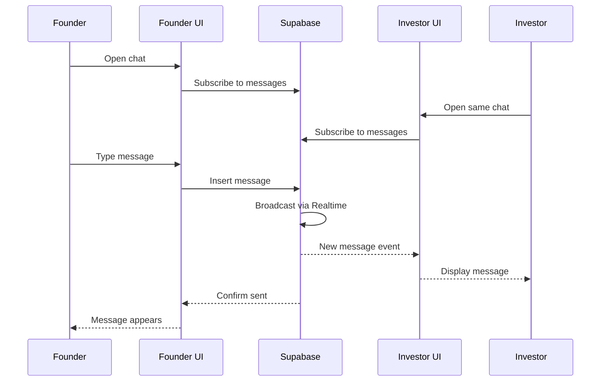
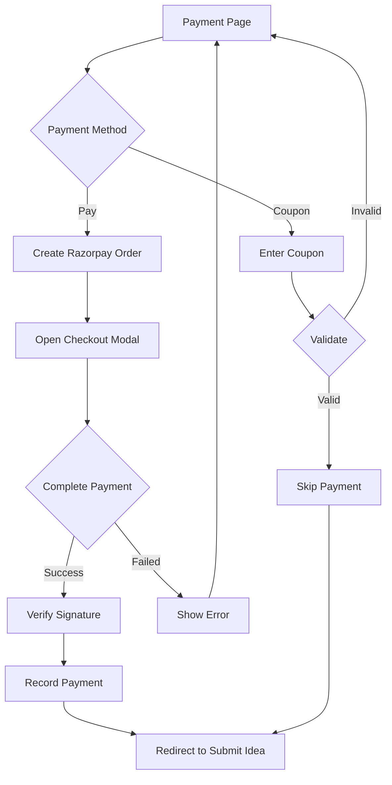

# 🔄 User Flows

> Complete user journey documentation for INNOVESTOR

---

## 🗺️ Overview

INNOVESTOR has three main user types, each with distinct flows:
1. **Founders** - Submit ideas, receive investment requests
2. **Investors** - Browse ideas, connect with founders  
3. **Admins** - Manage users, oversee platform

---

## 🚀 Founder Journey

### 1. Registration & Onboarding

### 2. Profile Setup Details

| Field | Required | Description |
|-------|----------|-------------|
| Full Name | ✅ | Display name |
| Phone | ✅ | Contact number |
| Date of Birth | ✅ | Verification |
| Education | ✅ | Background |
| Experience | ❌ | Work history |
| Current Job | ❌ | Current position |
| LinkedIn | ❌ | Professional profile |
| Avatar | ❌ | Profile picture |

### 3. Idea Submission (3 Steps)

**Step 1: Basic Details**
- Project Title
- Domain/Industry
- Investment Needed

**Step 2: Traction & Team**
- Current Stage
- Team Size
- Metrics/Traction

**Step 3: The Pitch**
- Full Description
- Google Drive Link (Pitch Deck)

### 4. Managing Connections

### 5. Dashboard Features
- 📊 View metrics (views, requests, investments)
- 💬 Manage chat requests (accept/reject)
- 📝 View and edit ideas
- 📌 Pin important conversations
- 👍👎 Rate investors

---

## 💼 Investor Journey

### 1. Registration & Onboarding

### 2. Profile Setup Details

| Field | Required | Description |
|-------|----------|-------------|
| Full Name | ✅ | Display name |
| Phone | ✅ | Contact number |
| Investment Capital | ✅ | Available funds |
| Interested Domains | ✅ | Preferred industries |
| Experience | ❌ | Investment history |
| LinkedIn | ❌ | Professional profile |
| Avatar | ❌ | Profile picture |

### 3. Browsing & Connecting

### 4. Dashboard Features
- 🔍 Browse all available ideas
- 📋 View idea details and pitch decks
- 📨 Send connection requests
- 💬 Chat with accepted founders
- ⭐ Watchlist for tracking ideas
- 📊 View portfolio and analytics

---

## 🛡️ Admin Journey

### 1. Access Admin Portal

### 2. Admin Capabilities
- 👥 View all users (founders & investors)
- ✅ Approve/reject user profiles
- 💡 View all submitted ideas
- 📊 Platform analytics
- 💳 Payment records

---

## 🔐 Authentication Flow

### Login Flow

### Registration Flow

---

## 💬 Chat Flow

### Real-time Messaging

---

## 💳 Payment Flow

### Razorpay Checkout

---

## 🔗 Related Documents

- [[00 - Overview|Overview]]
- [[04 - Features|Features]]
- [[Founders/00 - Founder Hub|Founder Hub]]
- [[Investors/00 - Investor Hub|Investor Hub]]

---

*Last Updated: January 31, 2026*
