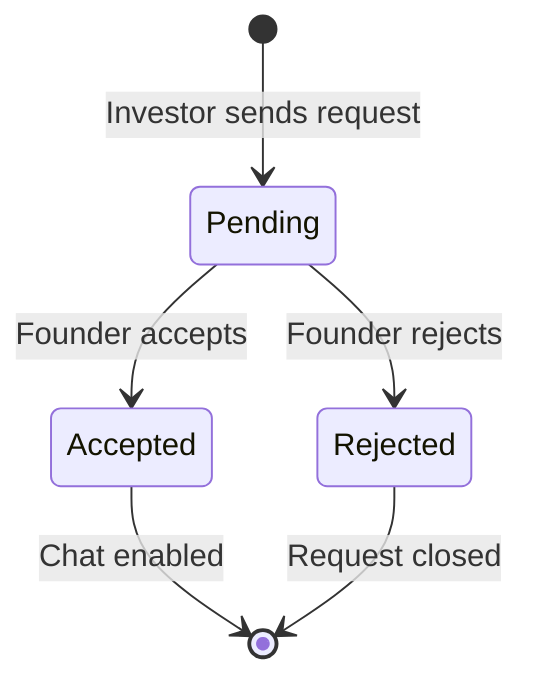

# ✨ Features

> Complete feature breakdown for INNOVESTOR

---

## 📋 Feature Matrix

| Feature | Founder | Investor | Admin | Status |
|---------|:-------:|:--------:|:-----:|:------:|
| Email Authentication | ✅ | ✅ | ✅ | Live |
| Profile Management | ✅ | ✅ | ✅ | Live |
| Idea Submission | ✅ | ❌ | View | Live |
| Idea Browsing | Own | ✅ | ✅ | Live |
| Chat Requests | Receive | Send | View | Live |
| Real-time Messaging | ✅ | ✅ | ❌ | Live |
| Investment Recording | ✅ | ❌ | View | Live |
| Investor Ratings | ✅ | ❌ | View | Live |
| Payment (Razorpay) | ✅ | ❌ | View | Live |
| Admin Approval | ❌ | ❌ | ✅ | Live |

---

## 🔐 Authentication Features

### Email/Password Auth
- **Registration** with email verification
- **Login** with remember session
- **Password** requirements enforced
- **Session** management via Supabase

### Profile Types
| Type | Access | Payment Required |
|------|--------|------------------|
| Founder | Submit ideas, receive requests | ✅ ₹99 |
| Investor | Browse ideas, send requests | ❌ Free |

### Validation Rules
```typescript
// Registration Schema
{
  email: z.string().email(),
  password: z.string().min(6),
  confirmPassword: z.string().min(6),
  userType: z.enum(["founder", "investor"])
}
```

---

## 📝 Idea Management

### Submission Process
Three-step wizard with validation:

1. **Basic Details**
   - Title (required)
   - Domain/Industry (dropdown)
   - Investment Needed (numeric)

2. **Traction & Team**
   - Current Stage
   - Team Size
   - Key Metrics

3. **The Pitch**
   - Full Description (markdown supported)
   - Media URL (Google Drive link)

### Idea Statuses
| Status | Description | Visual |
|--------|-------------|--------|
| `pending` | Awaiting review | 🟡 Yellow |
| `in_progress` | Active discussions | 🔵 Blue |
| `funded` | Investment received | 🟢 Green |
| `completed` | Project finished | ⚪ Gray |

### Domain Categories
- Technology
- Healthcare
- Finance
- Education
- E-commerce
- Agriculture
- Entertainment
- Others

---

## 💬 Messaging System

### Chat Request States


### Real-time Features
- **Live updates** via Supabase Realtime
- **Read receipts** (is_read status)
- **Unread counter** badge
- **Pin conversations** for quick access
- **Keyboard shortcuts** (Ctrl+N for new chat)

### Chat UI Features
- Premium glassmorphism design
- Message timestamps
- Avatar display
- Typing area with send button
- Chat history scroll

---

## 💳 Payment System

### Razorpay Integration
- **Amount**: ₹99 (Indian Rupees)
- **Currency**: INR
- **Gateway**: Razorpay Checkout

### Coupon System
| Coupon Code | Discount | Status |
|-------------|----------|--------|
| `FREEIDEA` | 100% | Active |
| `INNOVESTOR100` | 100% | Active |
| `SKIP2026` | 100% | Active |

### Payment Flow
1. User clicks "Pay Now"
2. Razorpay order created
3. Checkout modal opens
4. User completes payment
5. Signature verified
6. Payment recorded in DB
7. User redirected to Submit Idea

---

## 📊 Dashboard Features

### Founder Dashboard

#### Metrics Panel
- Total Ideas
- Total Views
- Chat Requests Pending
- Investments Received

#### Ideas Management
- View all submitted ideas
- See investment progress
- Track idea status
- Record new investments

#### Connections Panel
- Pending requests (accept/reject)
- Active chats
- Pin important conversations
- Rate investors (👍/👎)

#### Analytics
- Investment trends chart
- Domain distribution pie chart

### Investor Dashboard

#### Browse Feed
- All available ideas
- Filter by domain
- Filter by investment range
- View idea details

#### Request Management
- Send connection requests
- Track request status
- View accepted chats

#### Watchlist
- Save interesting ideas
- Quick access to favorites

#### Analytics
- Investment portfolio
- Domain preferences

---

## 🛡️ Admin Portal

### User Management
- View all registered users
- Approve/reject profiles
- Filter by user type

### Idea Oversight
- View all ideas
- Monitor status changes
- Flag suspicious content

### Payment Records
- View all transactions
- Check payment status
- Coupon usage tracking

---

## 🎨 UI/UX Features

### Design System
- **Theme**: Dark mode with accent colors
- **Style**: Fintech/Enterprise aesthetic
- **Effects**: Glassmorphism, animated gradients

### Animations
- Page transitions (fade/slide)
- Staggered list animations
- Hover effects on cards
- Interactive particle background

### Responsive Design
- Mobile-first approach
- Breakpoints: sm, md, lg, xl
- Touch-friendly interactions

### Accessibility
- Semantic HTML
- ARIA labels
- Keyboard navigation
- Focus indicators

---

## 🔜 Upcoming Features

### Phase 5 (In Progress)
- [ ] Advanced notification system
- [ ] Email notifications for chat
- [ ] Push notifications (PWA)
- [ ] Enhanced analytics dashboard

### Phase 6 (Planned)
- [ ] Video call integration
- [ ] Document signing (e-sign)
- [ ] Mobile app (React Native)
- [ ] AI-powered idea matching

---

## 🔗 Related Documents

- [[00 - Overview|Overview]]
- [[03 - User Flows|User Flows]]
- [[Development/01 - Component Library|Component Library]]

---

*Last Updated: January 31, 2026*
