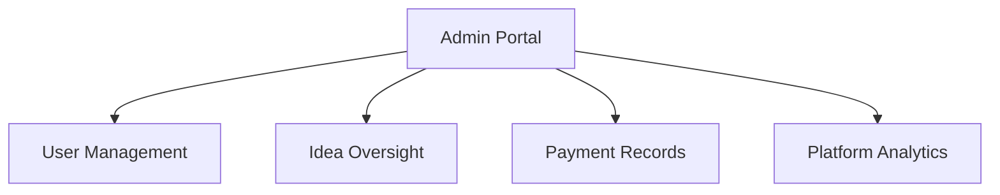

# 🔐 Accessing Admin Portal

> How to access and use the admin portal

---

## 🔑 Access URL

```
/admin-innovestor
```

Navigate to: `https://yoursite.com/admin-innovestor`

---

## 👤 Who Can Access

Only authorized administrators with:
- Valid Supabase auth account
- Admin privileges in database

---

## 🖥️ Admin Dashboard Overview



---

## 📋 Main Sections

| Section | Function |
|---------|----------|
| **Users** | View, filter, approve/reject profiles |
| **Ideas** | View all submitted ideas |
| **Payments** | View transaction history |
| **Analytics** | Platform metrics (if enabled) |

---

## 🔗 Related Documents

- [[00 - Admin Hub|Admin Hub]]
- [[02 - User Management|User Management]]
- [[03 - Platform Analytics|Platform Analytics]]

---

*Last Updated: February 1, 2026*
