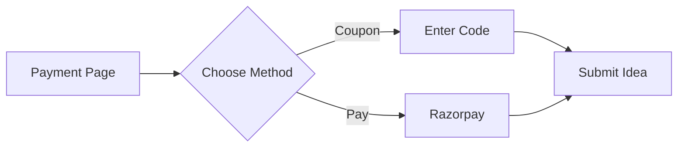

# 🚀 Getting Started as Founder

> Step-by-step guide for new founders

---

## 📋 Prerequisites

Before you begin:
- [ ] Valid email address
- [ ] Phone number for verification
- [ ] Pitch deck ready (Google Drive link)
- [ ] Clear investment amount in mind

---

## 🔑 Step 1: Registration

1. Go to [INNOVESTOR Landing Page](/)
2. Click **"Get Started"** or **"Launch Your Vision"**
3. Select **"Founder"** as your user type
4. Enter your email and create a password
5. Check your email for verification link
6. Click the verification link

---

## 👤 Step 2: Profile Setup

Fill in your professional details:

| Field | Required | Tips |
|-------|:--------:|------|
| Full Name | ✅ | Use your professional name |
| Phone | ✅ | Working number for contact |
| Date of Birth | ✅ | For verification |
| Education | ✅ | Highest qualification |
| Experience | ❌ | Relevant work history |
| Current Job | ❌ | Your current role |
| LinkedIn | ❌ | Helps build credibility |
| Avatar | ❌ | Professional photo |

---

## 💳 Step 3: Payment

**Cost**: ₹99 (one-time fee per idea)

### Payment Options:
1. **Razorpay Checkout** - Cards, UPI, Net Banking
2. **Coupon Code** - Use `FREEIDEA` for free access

### Payment Flow:

---

## 💡 Step 4: Submit Your Idea

### Wizard Steps:

**Step 1: Basic Details**
- Project Title (catchy, memorable)
- Domain/Industry selection
- Investment needed (be realistic)

**Step 2: Traction & Team**
- Current stage of your startup
- Team size and composition
- Key metrics and traction

**Step 3: The Pitch**
- Detailed description
- Google Drive link to pitch deck

> [!TIP]
> Make your pitch deck accessible! Set sharing to "Anyone with the link can view"

---

## 📊 Step 5: Dashboard

After submission, you'll land on your **Founder Dashboard**:

### Key Sections:
- **Metrics** - Views, requests, investments
- **Ideas** - Your submitted ideas
- **Connections** - Investor chat requests
- **Analytics** - Investment trends

### First Actions:
1. Review your submitted idea
2. Keep an eye on incoming requests
3. Respond to investor queries promptly

---

## 💬 Managing Investor Requests

When an investor shows interest:

1. **Review** their profile and investment history
2. **Accept** to start chatting, or **Reject** if not a fit
3. **Chat** professionally about your venture
4. **Record** any investments received

> [!IMPORTANT]
> Respond to requests within 24-48 hours for best results!

---

## 🔗 Related Documents

- [[00 - Founder Hub|Founder Hub]]
- [[02 - Submitting Your Idea|Submitting Ideas]]
- [[03 - Managing Connections|Managing Connections]]

---

*Last Updated: January 31, 2026*
