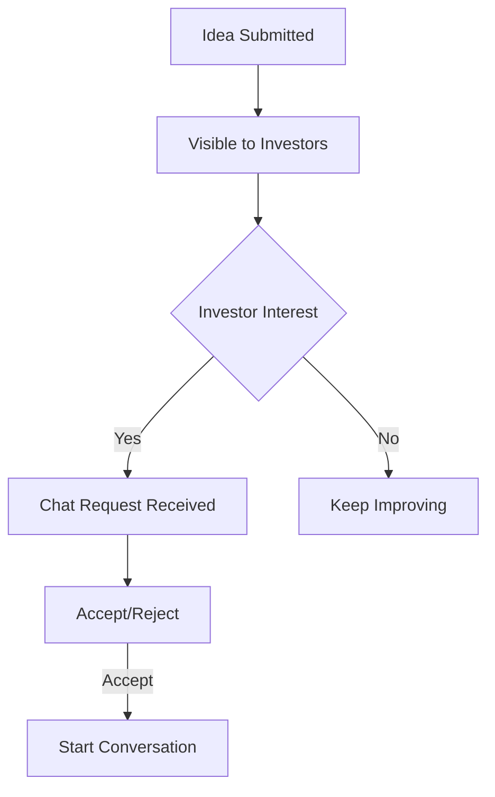

# 📝 Submitting Your Idea

> Complete guide for submitting your startup idea

---

## 📋 Before You Submit

Ensure you have:
- [x] Paid ₹99 or used a valid coupon
- [ ] Pitch deck ready on Google Drive
- [ ] Clear investment amount defined
- [ ] Compelling title and description

---

## 🧙‍♂️ The 3-Step Wizard

### Step 1: Basic Details

| Field | Required | Tips |
|-------|:--------:|------|
| **Title** | ✅ | Short, memorable, catchy |
| **Domain** | ✅ | Select from dropdown |
| **Investment Needed** | ✅ | Be realistic |

**Domain Options:**
- Technology
- Healthcare  
- Finance
- Education
- E-commerce
- Agriculture
- Entertainment
- Others

---

### Step 2: Traction & Team

Share your progress:

| Field | Description |
|-------|-------------|
| Current Stage | Idea/MVP/Revenue/Growth |
| Team Size | Number of co-founders/employees |
| Key Metrics | Users, revenue, growth rate |

> [!TIP]
> Even early-stage startups can highlight:
> - Problem validation interviews
> - Waitlist signups
> - Industry research completed

---

### Step 3: The Pitch

| Field | Required | Description |
|-------|:--------:|-------------|
| **Description** | ✅ | Full pitch (supports markdown) |
| **Media URL** | ✅ | Google Drive link |

#### Writing a Great Description

```markdown
## Problem
What problem are you solving?

## Solution
How does your product solve it?

## Market
Who is your target audience? How big?

## Traction
What have you achieved so far?

## Team
Who's building this?

## Ask
What do you need from investors?
```

#### Setting Up Google Drive Link

1. Upload pitch deck to Google Drive
2. Right-click → Share
3. Change to "Anyone with link can view"
4. Copy the link
5. Paste in Media URL field

---

## ✅ After Submission

Your idea is now live! Here's what happens:



### Next Steps:
1. Monitor your dashboard for requests
2. Respond promptly to investor queries
3. Update idea status as you progress

---

## 📊 Idea Statuses

| Status | Meaning | Action |
|--------|---------|--------|
| 🟡 Pending | Just submitted | Await investor interest |
| 🔵 In Progress | Active discussions | Respond to chats |
| 🟢 Funded | Investment received | Record investment |
| ⚪ Completed | Project finished | Close out |

---

## 🔗 Related Documents

- [[00 - Founder Hub|Founder Hub]]
- [[01 - Getting Started as Founder|Getting Started]]
- [[03 - Managing Connections|Managing Connections]]

---

*Last Updated: February 1, 2026*
