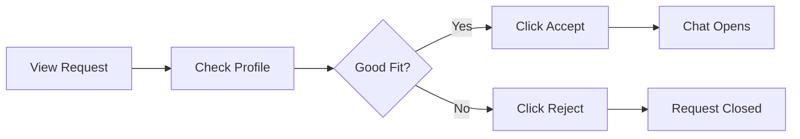

# 💬 Managing Connections

> How to handle investor chat requests effectively

---

## 📥 Receiving Requests

When an investor is interested in your idea, you'll receive a **chat request**.

### Request Notification
- Appears in your **Connections** panel
- Shows investor name and idea they're interested in
- Badge shows pending request count

---

## ⚖️ Evaluating Requests

Before accepting, consider:

| Factor | What to Check |
|--------|---------------|
| **Profile** | Experience, investment capital |
| **LinkedIn** | Verify professional background |
| **Domains** | Match with your sector? |
| **Capital** | Sufficient for your needs? |

---

## ✅ Accepting a Request

### After Accepting:
1. Chat window becomes available
2. Introduce yourself professionally
3. Share additional materials if needed
4. Discuss investment terms

---

## ❌ Rejecting a Request

It's okay to reject if:
- Investor doesn't match your sector
- Investment capacity too low
- Profile seems suspicious
- Already funded

> [!NOTE]
> Rejected requests are permanently closed. The investor can send a new request later if desired.

---

## 💬 Chat Best Practices

### Do:
- ✅ Respond within 24-48 hours
- ✅ Be professional and transparent
- ✅ Share additional materials via Google Drive
- ✅ Be clear about your ask
- ✅ Follow up consistently

### Don't:
- ❌ Share sensitive info too early
- ❌ Make unrealistic promises
- ❌ Ignore messages
- ❌ Be pushy or aggressive

---

## 📌 Pinning Conversations

For important investors:
1. Click the **pin icon** on the chat
2. Pinned chats appear at top
3. Unpin by clicking again

---

## 👍👎 Rating Investors

After interactions, you can rate investors:

| Rating | Meaning |
|--------|---------|
| 👍 Positive | Good experience, professional |
| 👎 Negative | Poor experience, unprofessional |

This helps:
- Build investor reputation
- Help other founders
- Improve platform quality

---

## 📊 Tracking Connections

Your dashboard shows:
- **Pending**: Awaiting your response
- **Active**: Accepted, chatting
- **Total**: All requests received

---

## 🔗 Related Documents

- [[00 - Founder Hub|Founder Hub]]
- [[02 - Submitting Your Idea|Submitting Ideas]]
- [[04 - Recording Investments|Recording Investments]]

---

*Last Updated: February 1, 2026*
