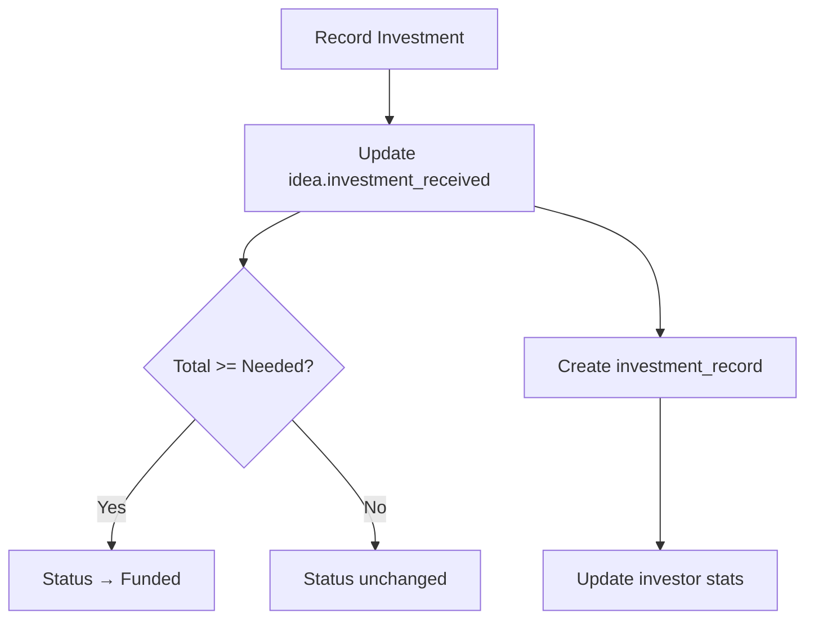

# 💰 Recording Investments

> How to track investments received

---

## 📋 Overview

When an investor commits funding, you can record it directly in INNOVESTOR. This helps:
- Track your fundraising progress
- Update idea status automatically
- Maintain investment history

---

## 📝 Recording an Investment

### Step-by-Step

1. Go to **Founder Dashboard**
2. Find the idea that received investment
3. Click **"Record Investment"** button
4. Fill in the details:

| Field | Required | Description |
|-------|:--------:|-------------|
| Amount | ✅ | Investment amount (₹) |
| Investor | ✅ | Select from your connections |
| Payment Method | ❌ | Bank/UPI/Cash/Other |
| Date | ❌ | Investment date |
| Notes | ❌ | Additional details |

5. Click **Submit**

---

## 🔄 What Happens After Recording

### Automatic Updates:
- `investment_received` increases by amount
- If fully funded, status changes to "Funded"
- Investment record created for history
- Investor's `total_investments` updates

---

## 📊 Viewing Investment History

Access in dashboard:
- **Metrics Panel**: Total investments received
- **Idea Cards**: Progress bar shows funding %
- **Analytics**: Investment trends chart

---

## 📈 Investment Progress

| Progress | Visual | Status |
|----------|--------|--------|
| 0% | ⬜⬜⬜⬜⬜ | Pending |
| 25% | 🟦⬜⬜⬜⬜ | In Progress |
| 50% | 🟦🟦🟦⬜⬜ | In Progress |
| 75% | 🟦🟦🟦🟦⬜ | In Progress |
| 100% | 🟦🟦🟦🟦🟦 | Funded |

---

## 💡 Tips

> [!TIP]
> - Record investments promptly for accurate tracking
> - Add notes with investment terms for reference
> - Update status manually if needed

> [!IMPORTANT]
> Investment recording is for tracking only. Actual fund transfers happen outside the platform.

---

## 🔗 Related Documents

- [[00 - Founder Hub|Founder Hub]]
- [[03 - Managing Connections|Managing Connections]]
- [[../02 - Database Schema|Database Schema]]

---

*Last Updated: February 1, 2026*
