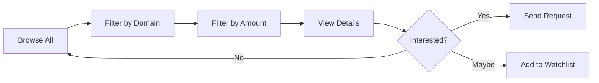

# 💼 Getting Started as Investor

> Step-by-step guide for new investors

---

## 📋 Prerequisites

Before you begin:
- [ ] Valid email address
- [ ] Phone number
- [ ] Investment capital ready
- [ ] Clear domain preferences

---

## 🔑 Step 1: Registration

1. Go to [INNOVESTOR Landing Page](/)
2. Click **"Get Started"** or **"Find Your Investment"**
3. Select **"Investor"** as your user type
4. Enter your email and create a password
5. Check your email for verification link
6. Click the verification link

> 🎉 **Great news!** INNOVESTOR is completely **FREE** for investors!

---

## 👤 Step 2: Profile Setup

Fill in your investment profile:

| Field | Required | Tips |
|-------|:--------:|------|
| Full Name | ✅ | Professional name |
| Phone | ✅ | Contact number |
| Investment Capital | ✅ | Available funds |
| Interested Domains | ✅ | Select multiple |
| Experience | ❌ | Investment history |
| LinkedIn | ❌ | Build credibility |
| Avatar | ❌ | Professional photo |

### Domain Options:
- Technology & SaaS
- Healthcare & Medtech
- Finance & Fintech
- Education & Edtech
- E-commerce & Retail
- Agriculture & Agritech
- Entertainment & Media
- Others

---

## 🔍 Step 3: Browse Ideas

### Dashboard Overview

Your **Investor Dashboard** shows:
- **Ideas Feed** - All available opportunities
- **Filters** - Narrow by domain, investment range
- **Watchlist** - Your saved ideas
- **Connections** - Active conversations

### Filtering Tips:

---

## 📨 Step 4: Connect with Founders

### Sending a Request:
1. Click on an idea card to view details
2. Review the pitch deck (Google Drive link)
3. Click **"Send Connection Request"**
4. Wait for founder's response

### Request Statuses:
| Status | Meaning |
|--------|---------|
| 🟡 Pending | Awaiting founder response |
| 🟢 Accepted | You can start chatting |
| 🔴 Rejected | Founder declined |

---

## 💬 Step 5: Chat & Negotiate

Once accepted:
1. Open the chat from **Connections** panel
2. Introduce yourself professionally
3. Ask clarifying questions
4. Discuss investment terms
5. Finalize outside the platform

> [!TIP]
> Be professional and transparent about your intentions!

---

## ⭐ Using the Watchlist

Save interesting ideas for later:
1. Click the **star icon** on any idea card
2. Access saved ideas from **Watchlist** tab
3. Remove by clicking star again

---

## 📊 Your Portfolio

Track your investments:
- View ideas you've invested in
- See total investment amounts
- Monitor domain distribution

---

## 🔗 Related Documents

- [[00 - Investor Hub|Investor Hub]]
- [[02 - Browsing Ideas|Browsing Ideas]]
- [[03 - Connecting with Founders|Connecting with Founders]]

---

*Last Updated: January 31, 2026*
