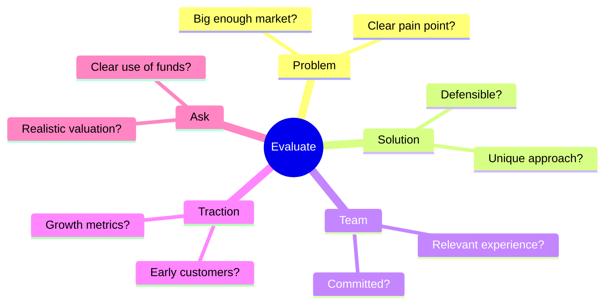

# 🔍 Browsing Ideas

> How to discover and evaluate startup opportunities

---

## 📋 The Ideas Feed

Your **Investor Dashboard** displays all available startup ideas.

### Feed Layout

Each idea card shows:
- 📌 **Title** - Startup name
- 🏷️ **Domain** - Industry category
- 💰 **Investment Needed** - Target funding
- 📊 **Progress** - Current funding %
- 👤 **Founder** - Creator name

---

## 🔍 Filtering Ideas

### By Domain
Filter by industry:
- Technology
- Healthcare
- Finance
- Education
- E-commerce
- Agriculture
- Entertainment
- Others

### By Investment Range
Filter by funding requirements:
- Under ₹1 Lakh
- ₹1-5 Lakhs
- ₹5-10 Lakhs
- ₹10-50 Lakhs
- Above ₹50 Lakhs

---

## 📄 Viewing Idea Details

Click any card to see:

| Section | Content |
|---------|---------|
| **Overview** | Title, domain, investment needed |
| **Description** | Full pitch details |
| **Founder Info** | Name, background |
| **Pitch Deck** | Google Drive link |
| **Progress** | Current funding status |

---

## 🎯 Evaluating Opportunities

### What to Look For

### Red Flags 🚩
- Vague problem statement
- No clear target market
- Unrealistic projections
- Incomplete pitch deck
- Unresponsive founder

### Green Flags ✅
- Clear problem-solution fit
- Evidence of traction
- Strong team background
- Realistic ask
- Well-prepared materials

---

## ⭐ Using the Watchlist

Save interesting ideas for later:

1. Click **star icon** on idea card
2. Idea saved to **Watchlist** tab
3. Access anytime from dashboard
4. Remove by clicking star again

---

## 📨 Next Step: Send Request

Found a promising opportunity?
→ [[03 - Connecting with Founders|Send a Connection Request]]

---

## 🔗 Related Documents

- [[00 - Investor Hub|Investor Hub]]
- [[01 - Getting Started as Investor|Getting Started]]
- [[03 - Connecting with Founders|Connecting with Founders]]

---

*Last Updated: February 1, 2026*
