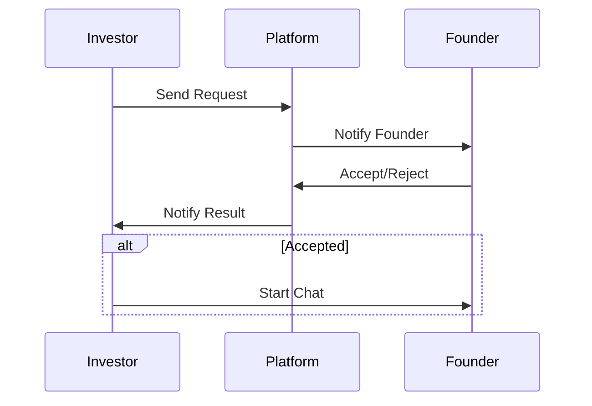
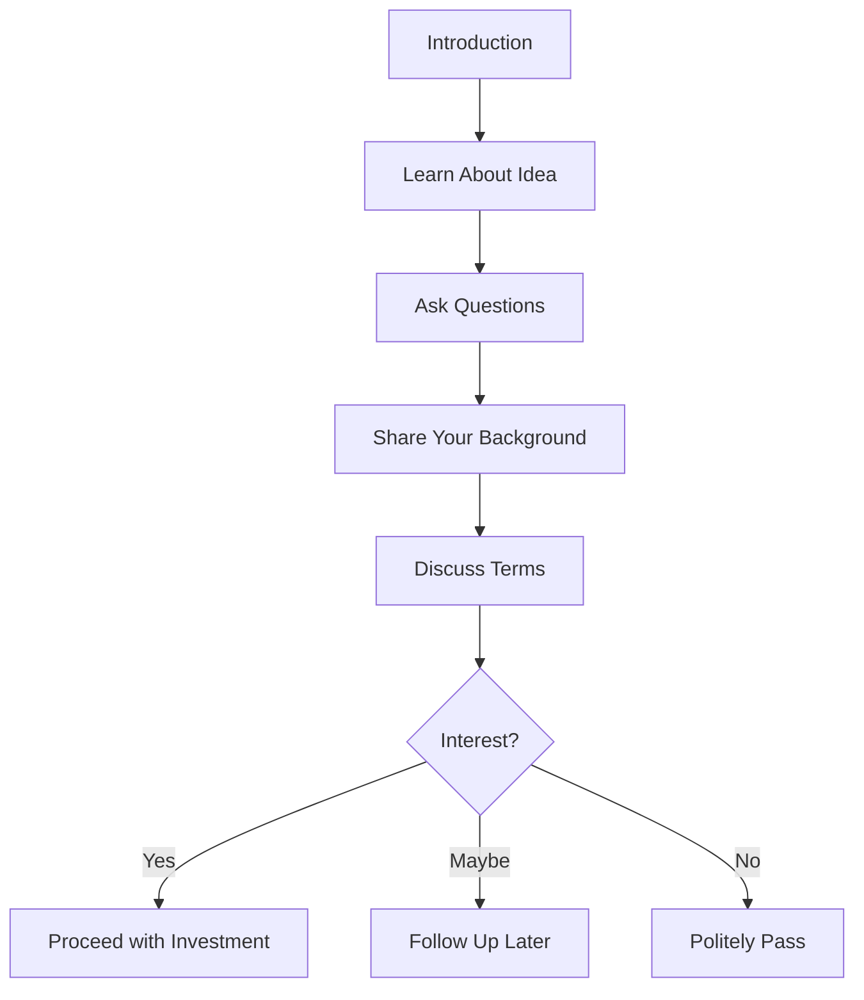

# 🤝 Connecting with Founders

> How to reach out and build relationships

---

## 📨 Sending a Connection Request

### Step-by-Step

1. Browse ideas and find one you like
2. Click the idea card to view details
3. Review the pitch deck
4. Click **"Send Connection Request"**
5. Wait for founder's response



---

## ⏳ Request Statuses

| Status | Meaning | Action |
|--------|---------|--------|
| 🟡 Pending | Awaiting response | Wait patiently |
| 🟢 Accepted | Founder accepted | Start chatting! |
| 🔴 Rejected | Founder declined | Try other ideas |

---

## 💬 After Acceptance

### Starting the Conversation

**Good first message:**
```
Hi [Founder Name],

I'm [Your Name], interested in [Domain] investments. 
Your idea caught my attention because [specific reason].

I'd love to learn more about:
- Your current traction
- Team background
- Use of funds

Looking forward to connecting!
```

### Conversation Flow



---

## 💬 Chat Best Practices

### Do:
- ✅ Introduce yourself clearly
- ✅ Show genuine interest
- ✅ Ask thoughtful questions
- ✅ Be transparent about your capacity
- ✅ Respond promptly

### Don't:
- ❌ Request confidential info too early
- ❌ Make unrealistic demands
- ❌ Ghost the founder
- ❌ Be pushy about terms

---

## 📊 Managing Multiple Conversations

### Tracking Requests

Your dashboard shows:
- **Pending**: Requests awaiting response
- **Active**: Accepted chats
- **Watchlist**: Saved ideas

### Prioritization Tips
1. Respond to accepted chats first
2. Check pending requests daily
3. Use watchlist for "maybe later"

---

## 🤝 Building Relationships

> [!TIP]
> **Long-term thinking**: Even if you don't invest now, maintaining relationships with founders can lead to future opportunities.

### After Investing
- Stay in touch periodically
- Offer help beyond capital
- Provide introductions
- Share relevant insights

---

## ⚠️ Due Diligence

Before committing funds:
- [ ] Verify founder identity  
- [ ] Check LinkedIn profile
- [ ] Review pitch deck thoroughly
- [ ] Ask for references
- [ ] Conduct background research
- [ ] Consult legal/financial advisors

---

## 🔗 Related Documents

- [[00 - Investor Hub|Investor Hub]]
- [[02 - Browsing Ideas|Browsing Ideas]]
- [[04 - Making Investments|Making Investments]]

---

*Last Updated: February 1, 2026*
