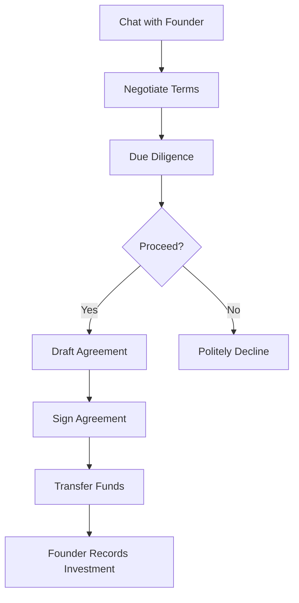

# 💰 Making Investments

> Guide to finalizing investments

---

## ⚠️ Important Disclaimer

> [!CAUTION]
> **INNOVESTOR is a connection platform only.** Actual investment transactions, legal agreements, and fund transfers happen **outside** the platform. Always consult legal and financial professionals.

---

## 📋 Investment Checklist

Before investing, complete:

### Due Diligence
- [ ] Reviewed pitch deck thoroughly
- [ ] Verified founder identity
- [ ] Checked founder's LinkedIn
- [ ] Asked clarifying questions
- [ ] Understood the business model
- [ ] Assessed market opportunity

### Legal & Financial
- [ ] Consulted with a lawyer
- [ ] Consulted with a financial advisor
- [ ] Reviewed investment terms
- [ ] Understood risks involved
- [ ] Prepared investment agreement

---

## 💼 Investment Process

---

## 📝 What to Agree On

| Term | Description |
|------|-------------|
| **Investment Amount** | How much you're investing |
| **Equity Stake** | Percentage of company |
| **Valuation** | Company valuation |
| **Vesting** | Any vesting schedules |
| **Board Seat** | If applicable |
| **Rights** | Information, voting, etc. |
| **Exit Terms** | Future liquidity options |

---

## 📄 Documentation Needed

Typically required (consult legal counsel):
- Term Sheet
- Share Purchase Agreement
- Shareholders Agreement
- Board Resolutions
- KYC Documentation

---

## 💳 Fund Transfer

> [!IMPORTANT]
> Transfer funds only after all legal documentation is signed and verified.

### Common Methods:
- Bank Transfer (NEFT/RTGS/IMPS)
- Wire Transfer
- Escrow Services

---

## 📊 After Investment

### Track in INNOVESTOR
- Founder will record the investment
- Your portfolio updates automatically
- See total investments in dashboard

### Outside Platform
- Maintain communication with founder
- Track company progress
- Attend board meetings (if applicable)
- Prepare for future rounds

---

## ⚖️ Risk Disclaimer

> [!WARNING]
> **Startup investing is high-risk.** You may lose your entire investment. Only invest what you can afford to lose. Past performance doesn't guarantee future results.

---

## 🔗 Related Documents

- [[00 - Investor Hub|Investor Hub]]
- [[03 - Connecting with Founders|Connecting with Founders]]
- [[../Legal/00 - Legal Overview|Legal Overview]]

---

*Last Updated: February 1, 2026*
